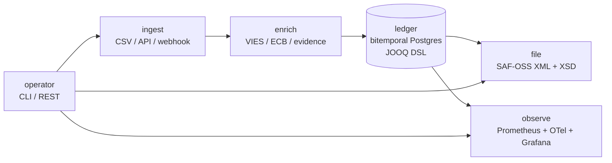

# stripe-eu-vat-moss

> An open-source EU VAT One-Stop-Shop automation engine. Sits next to a Stripe Tax integration and fills the last mile that Stripe stops at: file-ready SAF-OSS XML returns, evidence-of-location storage, VIES B2B validation, refund and correction handling, ECB currency conversion, and marketplace deemed-seller routing — with a bitemporal audit trail.

[](https://github.com/mateokadiu/stripe-eu-vat-moss/actions/workflows/ci.yml)
[](https://opensource.org/licenses/MIT)
[](#tech-stack)
[](#tech-stack)
[](#status)

Free, MIT, self-hostable.

## Contents

- [Why this exists](#why-this-exists)
- [What's in the box](#whats-in-the-box)
- [Quick start](#quick-start)
- [Architecture](#architecture)
- [Bitemporality](#bitemporality)
- [Compliance map](#compliance-map)
- [SAF-OSS notes](#saf-oss-notes)
- [Deploy](#deploy)
- [CLI](#cli)
- [Tech stack](#tech-stack)
- [Further reading](#further-reading)

## Why this exists

Every EU SaaS shop crossing the EUR 10,000 cross-border B2C threshold owes
quarterly OSS VAT returns in the Member State of identification. Stripe Tax
calculates per-line VAT correctly but does not file the return. The last
mile is left to merchants who either hand-key a quarterly summary into the
national portal, or pay a commercial SaaS for it.

`stripe-eu-vat-moss` is the missing engine: it ingests Stripe Tax data
(itemized CSV exports or live Standalone Tax API), enriches it with the EU
rules an auditor checks for, and emits SAF-OSS XML the operator uploads.

## What's in the box



- 27-country VAT rate matrix as Liquibase data, with 2026 changes pre-loaded
- ECB-pinned currency conversion (last day of period)
- VIES SOAP client with 24h cache + raw-response retention for audit
- Five evidence-piece types with conflict detection + 10y retention
- Append-only event store with bitemporal "as-of" replay
- SAF-OSS JAXB generator with XSD validation gate + sha-256 hashing
- Refund routing into the period when issued, never retroactive
- Stripe Connect deemed-seller mode (Art. 14a) via metadata override
- Picocli CLI mirroring the REST surface
- Micrometer dual registry (Prometheus + OTLP) + Grafana dashboard JSON

## Quick start

```bash
./gradlew check assemble
./gradlew :moss-api:bootRun
```

```bash
curl -X POST http://localhost:8080/ingest/csv \
  -H "Content-Type: text/csv" \
  --data-binary @itemized-export.csv
```

```bash
curl http://localhost:8080/periods/2026Q3
curl -X POST http://localhost:8080/periods/2026Q3/close
curl http://localhost:8080/periods/2026Q3/return.xml -o return.xml
```

## Architecture

<details open>
<summary><b>Modules</b> — nine Gradle projects, one-direction dependencies enforced by ArchUnit</summary>

Each module is a Gradle project. Inter-module dependencies go one direction; ArchUnit enforces that in `moss-it/arch/ModuleBoundariesTest`.

| Module | Responsibility |
|---|---|
| `moss-shared` | Value objects (Money in minor units, Country, Period, Iso4217Currency, Ids/UUIDv7). |
| `moss-ledger` | Append-only `events` table, bitemporal columns, `BitemporalRepository` for "as-of" replay. JOOQ DSL, no JPA. |
| `moss-enrich` | VIES validator with 24h cache, ECB daily-rate puller + quarter-close pin, evidence collector with conflict detection, place-of-supply resolver, marketplace deemed-seller router. |
| `moss-ingest` | Stripe CSV parser, Standalone Tax API orchestrator, webhook handler with signature verification + idempotency, resumable cursor. |
| `moss-file` | SAF-OSS JAXB types, marshaller with XSD validation gate, generator that aggregates supplies by (MS, rate) and corrections by (originalPeriod, MS), corrections router. |
| `moss-observe` | Micrometer dual registry (Prometheus + OTLP) + domain-specific counters and summaries; Grafana dashboard JSON. |
| `moss-api` | Spring Boot REST endpoints + OpenAPI yaml. |
| `moss-cli` | Picocli operator surface (`ingest-csv`, `close-period`, `generate-return`, `audit-replay`). |
| `moss-it` | Cross-module integration tests + ArchUnit module-boundary enforcement. |

</details>

<details>
<summary><b>Event store</b> — single <code>events</code> table, JSONB payload, optimistic concurrency via <code>(aggregate_id, version)</code></summary>

Single `events` table with a unique `(aggregate_id, version)` constraint enforces optimistic concurrency. Payload and metadata are JSONB. A `snapshots` table caches per-aggregate state for performance — events are still the source of truth, snapshots are an optimisation.

The SAF-OSS generator queries a denormalised projection built by a periodic projector that scans the events table. The projector is idempotent: re-running it overwrites the projection table, which is why snapshots and rate-pinning matter — they freeze the inputs the projection depends on.

</details>

## Bitemporality

<details>
<summary><b>Four time columns per event</b> — replays at the same as-of time always produce the same state</summary>

Every aggregate state event has four time columns:

- `valid_time_from` / `valid_time_to` — when the fact was true in the real world. Refunds and corrections set `valid_time_from` to the refund-issuance instant; the original sale's row keeps the original `valid_time_from`.
- `transaction_time_from` / `transaction_time_to` — when the row was recorded. Supersedure (e.g. a corrected place-of-supply decision) closes the prior row by setting `transaction_time_to` and inserts a new row with `transaction_time_from = now`.

The repository supports `loadStreamAsOf(aggregateId, asOf)` which returns the events that were visible at a given transaction time. Replays at the same as-of time always produce the same state.

```bash
# Replay the state of a transaction as it was visible on 2026-07-15
moss audit-replay --tx <uuid> --as-of 2026-07-15T10:00:00Z
```

</details>

## Compliance map

<details>
<summary><b>EU rule → file → test</b> — grep <code>encodesRule_</code> in the source to find proof</summary>

The rules below are encoded in the source. Each row maps to a concrete file + test; an auditor (or future-me) can grep for `encodesRule_` to find proof.

| Rule | Source | Where in code |
|---|---|---|
| EUR 10,000 EU-wide threshold for B2C cross-border | Council Directive 2017/2455, Art. 59c | `moss-enrich/.../place/PlaceOfSupplyResolver.java` |
| Place of supply = customer's MS above threshold | Council Directive 2017/2455, Art. 59c | same |
| Two non-conflicting evidences (one below EUR 100k) | Council Implementing Reg. 282/2011, Art. 24f | `moss-enrich/.../evidence/EvidenceBundle.java` |
| 10-year evidence retention | Council Directive 2006/112/EC, Art. 369k | `moss-enrich/.../evidence/EvidenceCollector.retentionUntil` |
| Quarterly OSS, due last day of month after period | Implementing Reg. (EU) 2019/2026 | `moss-shared/.../Period.filingDeadline()` |
| ECB rate on last day of tax period | Implementing Reg. (EU) 2019/2026 | `moss-enrich/.../currency/EcbCurrencyConverter.java` |
| Corrections in subsequent return only | OSS Guidelines, sec. 3.6 | `moss-file/.../corrections/CorrectionsRouter.java` |
| Refunds reflected in period when issued | OSS Guidelines, sec. 3.6 | same |
| SAF-OSS XSD voluntary standard | Commission Implementing Reg. 2021/965 | `moss-file/.../saf/SafOss.java` |
| Reverse charge requires valid VIES | Council Directive 2006/112/EC, Art. 196 | `moss-enrich/.../vies/CachedViesValidator.java` |
| Marketplace deemed-seller rules | Council Directive 2017/2455, Art. 14a | `moss-enrich/.../marketplace/DeemedSellerRouter.java` |
| Negative MS balances never set off across MS | OSS Guidelines, sec. 3.6 | `moss-file/.../generator/SafOssGenerator.java` |

</details>

<details>
<summary><b>Threshold (Art. 59c)</b> — the EUR 10,000 cross-border B2C trigger, year-by-year</summary>

The EUR 10,000 cross-border B2C threshold is applied year-by-year, with a running total carried in the supplier's filing currency. Once crossed in a given year, the supplier files OSS for every subsequent in-year cross-border transaction in that calendar year.

Below the threshold, the supplier-MS rules apply. The threshold is checked inside `PlaceOfSupplyResolver.resolve`; the running total is held in the read-model projection and fed to the resolver as a `Money` parameter.

</details>

<details>
<summary><b>Evidence (Art. 24f)</b> — two non-conflicting pieces of distinct type, 10y retention</summary>

Two non-conflicting pieces of evidence are required for every B2C electronic supply taxed in the EU. A "piece" is a row in `evidence_pieces` whose type falls into one of `BILLING_ADDRESS`, `IP_GEOLOCATION`, `BANK_LOCATION`, `MCC_PHONE`, `CUSTOMER_DECLARED`. Two pieces of the same type do not count as two distinct pieces — the resolver enforces this with a distinct-type check.

Operators below EUR 100k EU-wide annual turnover can set `MOSS_SMALL_ENTERPRISE_MODE=true` to relax this to one piece.

Each evidence row stores a `retention_until` date computed as `observed_at + 10 years`. A daily job (`RetentionSweeper`) purges rows past their retention; the row's `source_hash` (sha-256 of the raw source) is kept forever in a separate audit log to prove that evidence existed at filing time, even after deletion.

</details>

<details>
<summary><b>Currency (Implementing Reg. 2019/2026)</b> — ECB rates pinned at quarter close, replays deterministic</summary>

ECB euro reference rates are pulled daily from the published XML feed. When a period closes, the last-day rate for every (foreign currency → filing currency) pair seen in that period is pinned in `quarter_rates`. The `EcbCurrencyConverter` refuses to convert closed-period amounts against any rate other than the pinned one — replays therefore always yield the same number.

</details>

<details>
<summary><b>Corrections (OSS Guidelines, sec. 3.6)</b> — refunds in the issuing period, never retroactive</summary>

Refunds are reported in the period they were issued, not the original sale period. Prior-period rate or evidence revisions go into the next current return's `<Corrections>` block — the historical return is never amended.

`CorrectionsRouter.route` returns `Optional.empty()` for same-period adjustments (the caller should adjust the original line instead) and a `CorrectionEvent` for cross-period ones, with the routing computed from the operator's wall clock.

</details>

<details>
<summary><b>Reverse charge (Art. 196) + Marketplace deemed seller (Art. 14a)</b></summary>

**Reverse charge.** For B2B sales to a VIES-validated VAT number, the supplier collects no VAT and the reverse-charge mechanism applies. The validation is cached for 24 hours per VIES guidance; the raw response is retained as audit evidence.

**Marketplace deemed seller.** When a Stripe Connect platform is the deemed seller, the platform owes the OSS VAT for the transaction. The platform is identified per-transaction by the `deemed_seller=platform` metadata key on the charge, with an operator-level default via `MOSS_DEEMED_SELLER_DEFAULT`.

</details>

## SAF-OSS notes

<details>
<summary><b>Why we don't vendor a third-party XSD</b> — and how we stay structurally compliant anyway</summary>

The Commission Implementing Regulation (EU) 2021/965 of 9 June 2021 defines a voluntary "Standard Audit File for Tax — One-Stop-Shop" (SAF-OSS). The technical artefacts (XSD, code lists, user guide) are published by the Belgian Finance Ministry as the reference national implementation, but the XSD itself is gated behind portal-access registration.

Rather than vendor a third-party XSD we cannot redistribute, we encode the schema's data model as a set of JAXB-annotated Java records that mirror the fields enumerated in Article 2 and Annexes I and II of the Implementing Regulation. The resulting XML is structurally compliant; XSD-validated bytes are emitted only when an operator-supplied XSD is wired in via the `SafOssValidator` hook.

The structural elements we emit follow the schema's macro shape:

- a `SAF-OSS` envelope with a single `Header`,
- zero-or-more `Supply` rows grouped by member state of consumption + VAT rate,
- zero-or-more `Correction` rows covering refunds and rate revisions that affect earlier filing periods.

**References**

- Commission Implementing Regulation (EU) 2021/965, Articles 2 and Annexes I/II
- OSS Guidelines (EU Commission, July 2021), section 3.6 on corrections
- Belgian Finance Ministry SAF-OSS user guide

</details>

## Deploy

Three paths.

<details>
<summary><b>1. Local Docker</b> — single image, env-driven config</summary>

```bash
./gradlew :moss-api:jibDockerBuild
docker run --rm \
  -p 8080:8080 \
  -e DATABASE_URL=jdbc:postgresql://host.docker.internal:5432/moss \
  -e STRIPE_API_KEY=sk_test_... \
  -e STRIPE_WEBHOOK_SECRET=whsec_... \
  -e MOSS_IDENT_MEMBER_STATE=BE \
  -e MOSS_FILING_CURRENCY=EUR \
  ghcr.io/mateokadiu/stripe-eu-vat-moss:v1
```

</details>

<details>
<summary><b>2. Oracle Cloud Always Free (Pulumi-Java)</b> — 0 EUR/yr</summary>

[`infra/`](./infra/) provisions an Ampere ARM A1 VM (1 OCPU / 12 GB shape, free tier), Postgres 16 in a sibling VM, and Caddy reverse-proxying TLS. Total cost: 0 EUR/yr.

```bash
cd infra
pulumi up
```

The Pulumi program provisions the VM, configures cloud-init to fetch the image, runs Liquibase migrations on first boot, and registers a healthcheck. Secrets are stored in Pulumi configuration; nothing sensitive is committed.

</details>

<details>
<summary><b>3. Kubernetes manifest</b> — single-replica Deployment + Secret refs</summary>

```yaml
apiVersion: apps/v1
kind: Deployment
metadata:
  name: stripe-eu-vat-moss
spec:
  replicas: 1
  selector:
    matchLabels: { app: moss }
  template:
    metadata: { labels: { app: moss } }
    spec:
      containers:
        - name: moss
          image: ghcr.io/mateokadiu/stripe-eu-vat-moss:v1
          env:
            - name: DATABASE_URL
              valueFrom: { secretKeyRef: { name: moss, key: db-url } }
            - name: STRIPE_API_KEY
              valueFrom: { secretKeyRef: { name: moss, key: stripe-key } }
            - name: STRIPE_WEBHOOK_SECRET
              valueFrom: { secretKeyRef: { name: moss, key: webhook } }
          ports:
            - containerPort: 8080
          readinessProbe:
            httpGet: { path: /actuator/health, port: 8080 }
```

</details>

<details>
<summary><b>Environment variables</b> — required + optional knobs</summary>

| Name | Purpose |
|---|---|
| `DATABASE_URL` | JDBC URL for Postgres |
| `STRIPE_API_KEY` | Restricted-key read access to the Tax API |
| `STRIPE_WEBHOOK_SECRET` | Signing secret for the webhook receiver |
| `MOSS_IDENT_MEMBER_STATE` | e.g. BE, DE, IE |
| `MOSS_FILING_CURRENCY` | usually EUR |
| `MOSS_SMALL_ENTERPRISE_MODE` | true to allow 1 evidence piece |
| `MOSS_DEEMED_SELLER_DEFAULT` | true for marketplaces filing on behalf of underlying merchants |

</details>

## CLI

```bash
moss ingest-csv --file itemized-export.csv
moss close-period 2026Q3
moss generate-return 2026Q3 --out return.xml
moss audit-replay --tx <uuid> --as-of 2026-07-15T10:00:00Z
```

## Tech stack

- Java 21, Spring Boot 3.4, JOOQ DSL (no JPA)
- Postgres 16 with Liquibase migrations
- JAXB for SAF-OSS XML, optional XSD validation gate
- Picocli for CLI, OpenAPI yaml for REST
- Micrometer dual registry (Prometheus + OTLP) + Grafana dashboard JSON
- Jib for image build, semantic-release for versioning, CycloneDX SBOM

## Status

`v0.1.0` — engine and tooling are functional end-to-end. Pulumi-Java infra recipe ships under [`infra/`](./infra/); SBOM-on-tag and GHCR push live in [`.github/workflows/`](./.github/workflows/).

## Further reading

The full architecture, schema, decisions log and phase roadmap live in:

- [PLAN.md](./PLAN.md) — implementation plan + decisions
- [docs/architecture.md](./docs/architecture.md#modules) — bounded contexts deep-dive
- [docs/compliance-notes.md](./docs/compliance-notes.md#threshold-art-59c) — rule-by-rule legal map
- [docs/saf-oss-notes.md](./docs/saf-oss-notes.md) — XSD strategy notes
- [docs/deploy.md](./docs/deploy.md#3-kubernetes) — deployment recipes

The above sections inline the most-cited parts of those documents — the deep links land you at the specific heading if you want the full prose.

## License

MIT · [@mateokadiu](https://github.com/mateokadiu) · Copyright (c) 2026 Mateo Kadiu
